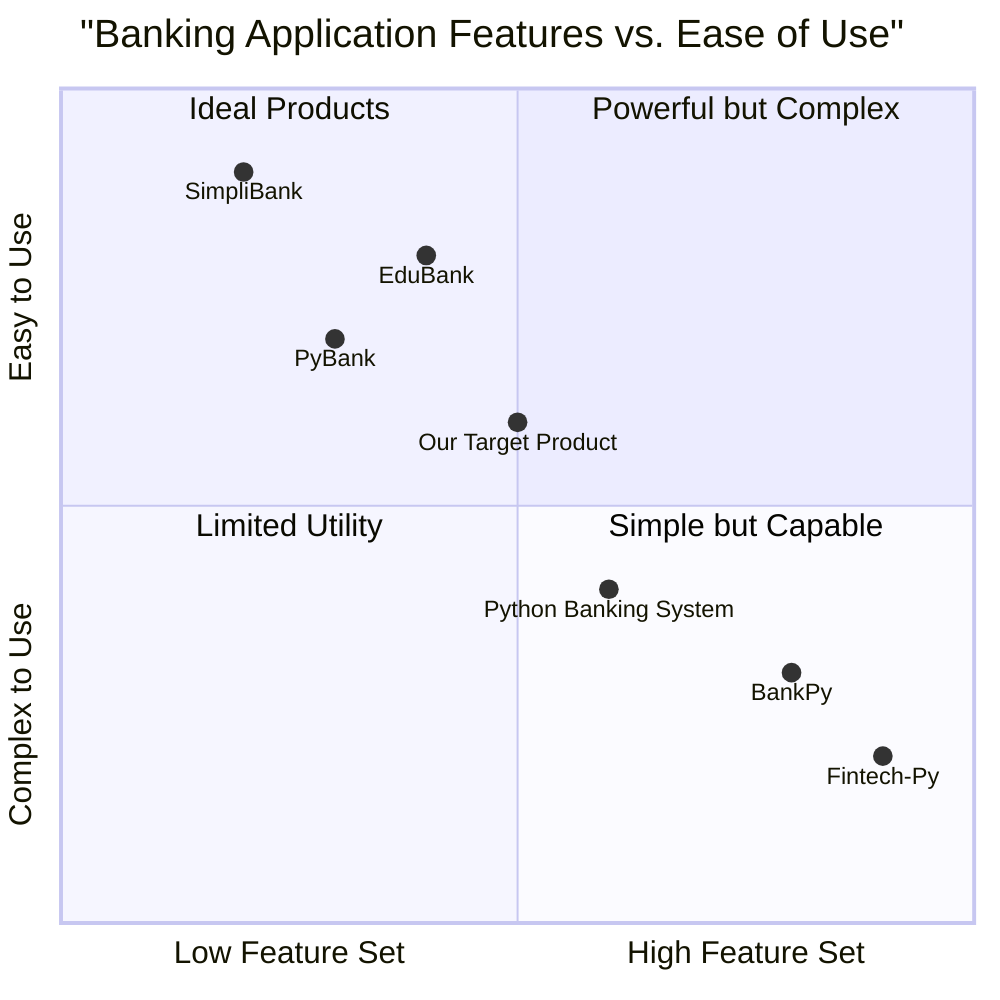

# Python Banking Application PRD - Colab Edition

## 1. Introduction

### 1.1 Document Purpose

This Product Requirements Document (PRD) outlines the specifications for a Python-based banking application designed to run in Google Colab environment. The document serves as a comprehensive guide for development, detailing features, user flows, and functional requirements.

### 1.2 Project Overview

The Banking Application (bank_app) is a Python-based system that allows users to manage bank accounts through a simple yet functional interface in Google Colab. The application will provide essential banking features including user management, account creation, deposits, withdrawals, and balance checking.

### 1.3 Original Requirements

* Add User 
* User detail modification
* User basic detail objects
* Deposit
* Withdrawal
* Check balance
* Update balance
* Open new account

## 2. Product Definition

### 2.1 Product Goals

1. **User-Friendly Financial Management**: Create an intuitive banking application that allows users to perform common banking operations in Google Colab with minimal friction.

2. **Educational Tool**: Serve as an educational resource for Python developers to understand banking application development concepts, data management, and financial operations.

3. **Secure Financial Operations**: Implement robust security measures to protect sensitive financial data while demonstrating best practices for banking application development.

### 2.2 User Stories

1. As a new user, I want to create an account with the banking system so that I can start using banking services.

2. As an account holder, I want to deposit money into my account so that I can increase my balance.

3. As an account holder, I want to withdraw money from my account when needed so that I can access my funds.

4. As an account holder, I want to check my balance at any time so that I can keep track of my finances.

5. As an account holder, I want to update my personal information so that my account details remain current.

### 2.3 Competitive Analysis

| Product | Pros | Cons |
|---------|------|------|
| **PyBank** | Easy to use, good documentation | Limited features, no transaction history |
| **BankPy** | Comprehensive features, strong security | Complex setup, steep learning curve |
| **Python Banking System** | Open-source, customizable | Minimal UI, requires technical knowledge |
| **Fintech-Py** | Modern architecture, API integration | Heavy resource usage, overcomplicated |
| **EduBank** | Educational focus, clear code | Basic functionality only, no encryption |
| **SimpliBank** | Clean interface, beginner friendly | Lacks advanced features, limited scalability |
| **Our Target Product** | Colab integration, balanced features, educational value | Limited to Colab environment, simpler UI than commercial solutions |

### 2.4 Competitive Quadrant Chart



## 3. Technical Specifications

### 3.1 Requirements Analysis

The banking application requires a robust Python-based system with the following components:

1. **User Management System**: Handle user creation, authentication, and profile management.

2. **Account Management System**: Handle account creation, linking to users, and account operations.

3. **Transaction System**: Process financial transactions like deposits and withdrawals.

4. **Data Storage Layer**: Store user data, account information, and transaction history.

5. **Security Framework**: Implement encryption, authentication, and authorization measures.

6. **Google Colab Integration**: Ensure compatibility with the Colab environment including data persistence solutions.

### 3.2 Requirements Pool

#### P0 (Must Have)

1. User creation and authentication functionality
2. Account creation linked to user profiles
3. Deposit and withdrawal operations
4. Balance checking functionality
5. Basic data persistence using CSV files in Google Drive
6. Transaction history logging
7. Basic security features (password hashing, input validation)

#### P1 (Should Have)

1. User profile editing functionality
2. Multiple account management for a single user
3. Transaction search and filtering
4. Data visualization for account balances and transactions
5. Session management and timeout features
6. Basic interest calculation

#### P2 (Nice to Have)

1. Multi-factor authentication
2. Advanced transaction analytics
3. Account statements generation (PDF)
4. Mock inter-account transfers
5. Role-based access controls (admin, teller, customer)
6. Password recovery mechanism

### 3.3 UI Design Draft

Since this application will run in Google Colab, the UI will be primarily notebook-based with a mix of code cells, markdown documentation, and output displays. The key components include:

1. **Setup Section**: Cell blocks for importing necessary libraries and initializing the application

2. **User Interface Functions**: Functions that display formatted output and gather user input

3. **Interactive Menu System**: Text-based menu system implemented using Python's input function

4. **Data Visualization Cells**: Matplotlib/Seaborn visualizations for account balances and transaction history

5. **Results Display**: Formatted output cells showing operation results

### 3.4 Data Architecture

#### User Object
```python
class User:
    def __init__(self, user_id, first_name, last_name, email, password_hash, phone=None, address=None):
        self.user_id = user_id
        self.first_name = first_name
        self.last_name = last_name
        self.email = email
        self.password_hash = password_hash
        self.phone = phone
        self.address = address
        self.accounts = []  # List of account IDs associated with this user
```

#### Account Object
```python
class Account:
    def __init__(self, account_number, user_id, account_type, balance=0):
        self.account_number = account_number
        self.user_id = user_id
        self.account_type = account_type  # "Savings", "Checking", etc.
        self.balance = balance
        self.creation_date = datetime.datetime.now()
        self.transaction_history = []  # List of Transaction objects
```

#### Transaction Object
```python
class Transaction:
    def __init__(self, transaction_id, account_number, transaction_type, amount, timestamp=None):
        self.transaction_id = transaction_id
        self.account_number = account_number
        self.transaction_type = transaction_type  # "Deposit", "Withdrawal"
        self.amount = amount
        self.timestamp = timestamp or datetime.datetime.now()
```

### 3.5 Data Storage Strategy

Since Google Colab is an ephemeral environment, data persistence requires special handling:

1. **Google Drive Integration**:
   - Mount Google Drive to persist data between sessions
   - Store data as CSV files or JSON in a dedicated folder

2. **CSV File Structure**:
   - users.csv: Store user information
   - accounts.csv: Store account details
   - transactions.csv: Store transaction history

3. **Backup Strategy**:
   - Create periodic backups of data files
   - Implement data versioning

## 4. Feature Specifications

### 4.1 User Management

#### 4.1.1 Add User

**Description**: Allow creation of new users in the banking system.

**User Flow**:
1. User selects "Create New User" option
2. System prompts for required information (name, email, password, etc.)
3. System validates inputs
4. System creates a user ID and hashes the password
5. System stores the user data
6. System confirms successful user creation

**Technical Requirements**:
- Must generate unique user IDs
- Must validate email format
- Must enforce password policies (min length, complexity)
- Must hash passwords before storage
- Must handle duplicate email addresses

#### 4.1.2 User Detail Modification

**Description**: Allow users to update their personal information.

**User Flow**:
1. User authenticates into the system
2. User selects "Update Profile" option
3. System displays current information
4. User selects which field to update
5. System prompts for new value
6. System validates and updates the information
7. System confirms successful update

**Technical Requirements**:
- Must authenticate user before allowing modifications
- Must validate inputs based on field type
- Must update only the specified fields
- Must log all profile changes

### 4.2 Account Management

#### 4.2.1 Open New Account

**Description**: Allow users to create new bank accounts.

**User Flow**:
1. User authenticates into the system
2. User selects "Open New Account" option
3. System displays available account types
4. User selects desired account type
5. System prompts for initial deposit (if required)
6. System generates a unique account number
7. System creates the account and links it to the user
8. System confirms successful account creation

**Technical Requirements**:
- Must generate unique account numbers
- Must enforce minimum initial deposit requirements (if applicable)
- Must link accounts to valid user IDs
- Must support multiple account types (Savings, Checking, etc.)

### 4.3 Transaction Management

#### 4.3.1 Deposit

**Description**: Allow users to add funds to their accounts.

**User Flow**:
1. User authenticates into the system
2. User selects "Deposit" option
3. If user has multiple accounts, system prompts for account selection
4. System prompts for deposit amount
5. System validates the amount
6. System updates the account balance
7. System logs the transaction
8. System confirms successful deposit

**Technical Requirements**:
- Must validate deposit amounts (positive values, within limits)
- Must update account balance atomically
- Must create transaction record with timestamp
- Must handle decimal values correctly

#### 4.3.2 Withdrawal

**Description**: Allow users to remove funds from their accounts.

**User Flow**:
1. User authenticates into the system
2. User selects "Withdrawal" option
3. If user has multiple accounts, system prompts for account selection
4. System prompts for withdrawal amount
5. System validates the amount against available balance
6. System updates the account balance
7. System logs the transaction
8. System confirms successful withdrawal

**Technical Requirements**:
- Must validate withdrawal amounts (positive values, within account balance)
- Must update account balance atomically
- Must create transaction record with timestamp
- Must implement overdraft protection

#### 4.3.3 Check Balance

**Description**: Allow users to view their current account balance.

**User Flow**:
1. User authenticates into the system
2. User selects "Check Balance" option
3. If user has multiple accounts, system prompts for account selection
4. System displays current balance along with recent transactions
5. Optionally, system offers to display transaction history

**Technical Requirements**:
- Must authenticate user before displaying balance
- Must retrieve current balance accurately
- Should display last few transactions for context
- Could provide visual representation of balance history

#### 4.3.4 Update Balance

**Description**: System function to update account balance after transactions.

**Internal Flow**:
1. Transaction operation calls update_balance() function
2. Function receives account ID and amount (positive for deposits, negative for withdrawals)
3. Function verifies the transaction is valid
4. Function updates the account balance
5. Function returns success/failure status

**Technical Requirements**:
- Must be atomic to prevent race conditions
- Must validate new balance wouldn't be negative
- Must update transaction history
- Must handle transaction failures gracefully

## 5. Security Considerations

### 5.1 Authentication Security

- Implement strong password hashing using bcrypt or Argon2
- Enforce password complexity requirements
- Implement account lockout after failed login attempts
- Use session management with proper timeouts

### 5.2 Data Security

- Encrypt sensitive user data
- Sanitize all user inputs
- Validate all transactions server-side
- Implement proper error handling without exposing system details

### 5.3 Google Colab-Specific Security

- Clear sensitive variables after use
- Avoid storing raw credentials in notebook cells
- Use Google Drive mounted storage with restricted access
- Warn users about the educational nature of the application

### 5.4 Transaction Security

- Implement transaction logs for audit purposes
- Use atomic operations for critical financial transactions
- Validate all transactions before processing
- Implement transaction limits for fraud prevention

## 6. Implementation Approach for Google Colab

### 6.1 Development Stack

- **Programming Language**: Python 3.x
- **Data Storage**: CSV files on Google Drive
- **Data Processing**: Pandas for data manipulation
- **Visualization**: Matplotlib and Seaborn for charts
- **Security**: Python libraries like bcrypt for password hashing

### 6.2 Colab Integration

- Mount Google Drive for persistent storage
- Use modular code organization with functions and classes
- Provide clear documentation in markdown cells
- Use Input widgets where appropriate
- Create visualization cells for financial data

### 6.3 Development Phases

1. **Phase 1**: Core user and account management
2. **Phase 2**: Transaction processing and balance management
3. **Phase 3**: Security implementation and data persistence
4. **Phase 4**: UI refinement and visualization enhancements
5. **Phase 5**: Testing and documentation finalization

## 7. Open Questions

1. Should the application support currency conversion or operate in a single currency?
2. What level of data analytics should be incorporated into the account reporting?
3. Should there be administrator functions separate from regular user functions?
4. What are the specific interest calculation formulas for different account types?
5. How should the system handle session persistence in the Colab environment?
6. What metrics should be captured for auditing purposes?

## 8. Success Metrics

1. **Functional Completeness**: All specified features work as expected
2. **Data Integrity**: Account balances and transaction history remain accurate
3. **Security Robustness**: Authentication and data protection measures work effectively
4. **Usability**: Users can navigate and use the application with minimal friction
5. **Educational Value**: Code is well-documented and concepts clearly explained